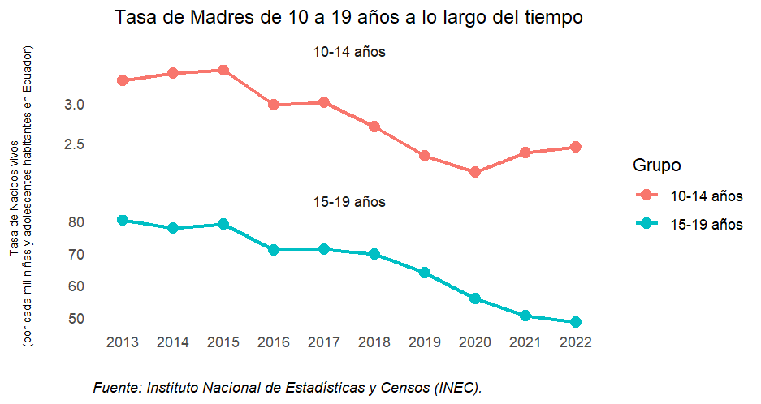
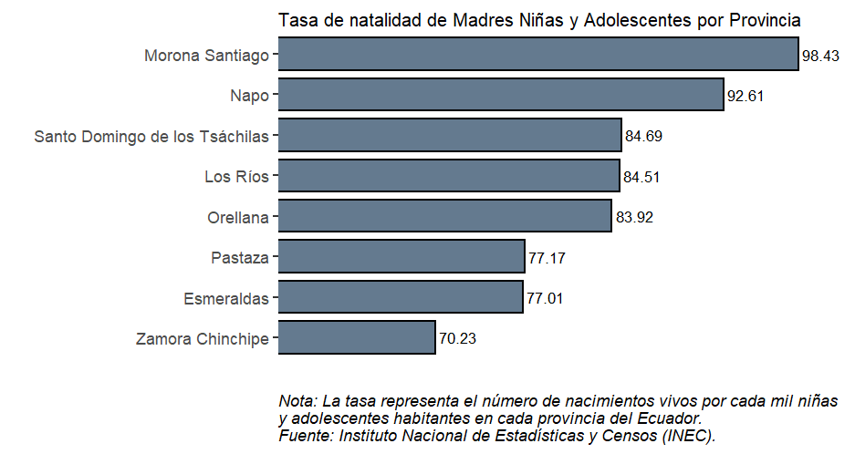

---
output:
  html_document:
    default
title: "¿Cuáles son las tasas de embarazo infantil y adolescente en Ecuador? Una Radiografía Cuantitativa de un Desafío Persistente"
author: Carolina Espinosa
bibliography: refs.bib
---

```{r setup, include = FALSE}
# Opciones de chunks
knitr::opts_chunk$set(echo = FALSE)
```
# Introducción

Ecuador históricamente ha enfrentado una problemática social y de salud pública[^1] difícil de ignorar: el embarazo infantil y adolescente. De acuerdo con las cifras del Instituto Nacional de Estadísticas y Censos (en adelante INEC), aproximadamente 5 niñas de 10 a 14 años y 104 adolescentes de 15 a 19 años son madres diariamente[^2]. En el 2013, según datos del Informe del Estado Mundial de Población, la tasa de embarazo en adolescentes en Ecuador se encontraba entre las más altas de América Latina, después de Nicaragua y República Dominicana [@ministerio_de_salud_publica_antecedentes_2018].

Este hecho plantea preguntas fundamentales sobre la educación, la equidad de género, la atención médica y otros conceptos sobre el bienestar social del país a lo largo de su historia. El objetivo de este artículo es examinar nuestra tendencia histórica de madres que se caracterizan por ser niñas y adolescentes en Ecuador mediante el estudio de datos estadísticos vitales recopilados por el INEC, correspondientes al periodo comprendido entre 2013 y 2022. Asimismo, se busca llevar a cabo un análisis detallado de la situación que reflejan dichas estadísticas.

# La realidad de las niñas y adolescentes ecuatorianas 
  
Antes de realizar un análisis de los datos sobre embarazos infantiles en el país, es coherente situar al problema dentro del contexto nacional. En Ecuador, donde se define como niño o niña a toda persona desde su concepción hasta los 12 años, y adolescente a toda persona mayor de 12 años y menor de 18, éstos grupos demográficos representan el 18.39% de la población [@naciones_unidas_resumen_2023].  La profundidad del embarazo infantil y adolescente se caracteriza por su complejidad multifacética, compuesta por varios ejes, como la desigualdad socioeconómica, la falta de educación sexual y la violencia de género. De acuerdo a ONU Mujeres, a través de  sus investigaciones metodológicas llevadas a cabo desde un enfoque interseccional en el año 2021, se evidencia que la tasa de pobreza multidimensional en niñas y adolescentes en Ecuador alcanza el 45.8%[^3], mientras que el nivel de analfabetismo alcanza un 17.9% [@naciones_unidas_ninas_nodate]. Esto contribuye directamente al problema, debido a que aumenta la vulnerabilidad de las niñas y adolescentes, las cuales tienen menos acceso a los recursos para educación sexual y reproductiva y servicios de salud adecuados, que podrían reducir los embarazos en edades tempranas. 

Por otra parte, la Convención sobre la Eliminación de Todas las Formas de Discriminación contra la Mujer (CEDAW), afirma que en Ecuador existe una falta de formación sistemática referente a derechos sexuales y reproductivos y en materia de salud en general por parte de docentes en enseñanza secundaria[@cedaw_convencion_2021]. Asimismo, los embarazos en niñas y adolescentes conlleva significativas tasas de deserción escolar, lo que a su vez se traduce en una disminución de oportunidades para mejorar la calidad de vida en el futuro [@naciones_unidas_ninas_nodate].

El embarazo en niñas y adolescentes está estrechamente relacionado con la violencia de género [@unfa_consecuencias_2020]. Este panorama se ve agravado por la disminución del 25% en el presupuesto asignado a políticas públicas para la igualdad de género entre 2017 y 2021 por parte del Estado ecuatoriano[@cedaw_convencion_2021]. Esta reducción presupuestaria podría intensificar la vulnerabilidad de niñas y adolescentes frente a embarazos no deseados, poniendo en peligro aún más los avances previos en la promoción de la igualdad y la lucha contra la violencia de género, ya que limita significativamente en la ejecución de programas y proyectos destinados a fortalecer los sistemas de protección frente a toda forma de violencia, incluida la desigualdad de poder y la violencia sexual hacia la mujer. 

# Tasa de nacidos vivos de madres niñas y adolescente en los últimos 10 años

```{r}

```

En el gráfico se puede visualizar la evolución de la tasa de nacidos vivos en niñas de 10 a 19 años en Ecuador durante un período de 10 años, desde 2013 hasta 2022, la cual se expresa en el número de nacidos vivos por cada mil niñas habitantes en el país. 
En el gráfico se realiza una segmentación según grupos etarios con el fin de facilitar la comprensión del problema social en cuestión. Se establece una distinción específica al dividir los datos en dos categorías: nacidos vivos de madres niñas de 10 a 14 años y nacidos vivos en madres adolescentes de 15 a 19 años. Esta diferenciación permite analizar de manera más detallada la incidencia del fenómeno en distintas franjas etarias, proporcionando así una base más sólida para la investigación, la formulación de estrategias y de políticas públicas. 

En el primer grupo etario (niñas de 10 a 14 años) en el año 2013, la tasa era de 3.28 por cada mil niñas y a lo largo de la década, se redujo gradualmente a 2.44 en 2022. Sin embargo, es importante destacar que a partir del 2020 la tasa de nacidos vivos incrementó levemente pasando de 2.13 en 2020 a 2.44 en 2022. Teniendo en cuenta que durante este periodo se atravesó la pandemia de COVID-19, es plausible que haya tenido un impacto en esta variación debido a que las niñas y adolescentes se encontraban más expuestas a diversos fenómenos y experimentaban una mayor vulnerabilidad, como la violencia de género en el ámbito doméstico, sin la posibilidad de acceder a redes de apoyo externas.   

En el segundo grupo etario (adolescentes de 15 a 19 años), también demuestra una tendencia decreciente, sin embargo, no se observa un pico después de la pandemia del COVID-19 como en el primer grupo etario. En el año 2013, la tasa era de 80 partos por cada mil adolescentes, y a lo largo de la década, experimentó una disminución significativa, llegando a 48 en 2022. Este descenso equivale a una reducción de aproximadamente un 39.56% en los embarazos de adolescentes durante los últimos 10 años. 

Sin embargo, es importante tomar en cuenta que al observar los tres últimos años, 2020, 2021 y 2022, la tasa de embarazos adolescentes no ha disminuido de manera significativa a comparación de los años anteriores. Tomando en cuenta que la precisión de la tasa estadística para estos años se ve afectada por la ausencia de proyecciones poblacionales actualizadas por parte del INEC, y en su lugar, se han empleado las proyecciones correspondientes al año 2019[^4].   

Aunque las cifras del gráfico reflejan una disminución en la tasa de embarazo durante estos 10 años, aún existen niveles significativos de embarazos en niñas y adolescentes. La situación actual sugiere que, a pesar de los esfuerzos realizados, subsisten desafíos persistentes que requieren una atención más intensa y estrategias más efectivas, así como,la revisión y ajuste de políticas actuales, junto con la identificación de áreas clave para intervenciones estructurales.

# Provincias con las mayores tasas de natalidad en el 2022

```{r}

```

Durante el año 2022, se registraron un total de 40,008 embarazos (parto) en niñas y adolescentes en Ecuador. El gráfico resalta las provincias en Ecuador con las tasas de embarazo (parto) más elevadas. En primer lugar se encuentra Morona Santiago, seguida de cerca por Napo, Santo Domingo de los Tsáchilas, Los Ríos y Orellana. Los datos reflejan una considerable disparidad en la tasa de embarazos de niñas y adolescentes, sobre todo en la región Amazónica, en la cual las tasas son notablemente superiores en comparación a otras regiones del país. 

Esta observación nos demuestra que la región amazónica enfrenta desafíos adicionales y sufre un mayor grado de factores de riesgo en términos de embarazos precoces. De acuerdo a Goicolea et al. (2009), el primer estudio de Latinoamerica que analizó los factores de riesgo asociados al embarazo infantil y adolescente en la Amazonía, determina la existencia de factores conductuales como la iniciación sexual temprana, falta de uso y conocimiento de anticonceptivos; junto a factores socioeconómicos desfavorables, experiencias de abuso sexual y la desintegración familiar, comunmente vivir periodos prolongados sin ambos padres.  Por ende, es crucial que el Estado entienda cuál es la realidad de cada región ecuatoriana, con el fin de formular políticas públicas adaptadas a las necesidades específicas de cada una de ellas. 

# Conclusión 

En base a los datos presentados en este artículo, se pueden concluir los siguiente:
 
1. A lo largo de la última década, tanto la tasa de nacidos vivos en niñas de 10 a 14 años como la tasa de embarazos en adolescentes de 15 a 19 años en Ecuador han disminuido. Sin embargo, es crucial tomar en cuenta la leve variación al alza a partir de 2020 en la tasa de nacidos vivos en niñas de 10 a 14 años lo sugiere una posible reversión en la tendencia descendente. 

2. Se evidencia un logro significativo en la reducción de embarazos en adolescentes de 15 a 19 años, con una disminución del 39.56% durante la última década. Sin embargo, en los tres últimos años (2020-2022) no existe una reducción significativa, lo que resalta la necesidad de analizar y fortalecer las estrategias de prevención de embarazo infantil y adolescente para mantener la tendencia positiva.

3. En el 2022, el análisis de los datos revela notables disparidades geográficas en las tasas de embarazo, destacando a Morona Santiago como la provincia con la tasa más alta. Los datos enfatizan la necesidad de indagar a fondo los factores que originan estas disparidades y adaptar las intervenciones a las necesidades específicas de cada provincia. 

Tomando en cuenta que existe una disminución constante en la tasa de embarazo infantil que refleja los esfuerzos y políticas implementados en Ecuador, es crucial reconocer que sigue siendo una realidad preocupante y dura que aún sufren las niñas y adolescentes ecuatorianas. Las cifras indican un número sustancial de casos, lo que subraya la necesidad urgente de fortalecer y expandir las medidas de prevención. Aún persistentes desafíos y grandes brechas que requieren atención continua, a través de un enfoque transdisciplinario e integral. 

El Estado debe reconocer y responder a las necesidades específicas de cada región, en aspectos estructurales que demandan atención, que incluyen la necesidad de fortalecer la educación sexual integral en el sistema educativo y fortalecer los derechos sexuales y reproductivos de las mujeres, así como la promoción de políticas públicas que aborden  la protección de niñas y adolescentes, la igualdad de género y temas socioeconómicos subyacentes. Además, es esencial trabajar en la erradicación de normas culturales que contribuyen a la vulnerabilidad de las niñas y adolescentes. Estos aspectos estructurales, cuando se abordan de manera integral, pueden contribuir significativamente a la creación de un entorno propicio para la protección y el bienestar de la juventud en Ecuador.

# Notas Metodológicas 

El análisis de la tasa de natalidad de Madres Niñas y Adolescentes se basa en las proyecciones de población proporcionadas por el Instituto Nacional de Estadística y Censos (INEC). Sin embargo, es importante señalar que las proyecciones de población del INEC están disponibles hasta el año 2019, que son las mas recientes a la fecha de redaccion del artículo. Reconocemos que esta elección puede introducir ciertas limitaciones en la exactitud de nuestros resultados, ya que no refleja posibles cambios demográficos que puedan haber ocurrido después de 2019.

# Referencias 

[^1]: El Art. 21 de la Ley Orgánica de Salud reconoce al embarazo infantil y adolescente como una problemática de salud pública, destacando el impacto que tiene para la sociedad en su conjunto.
[^2]:Se obtuvo el promedio en base a las cifras recopiladas por el INEC de la base de datos “Registro estadístico de Nacidos vivos del año 2022”.
[^3]:El Perfil de País según Igualdad de Género (PPIG), liderado por ONU Mujeres Ecuador, es un análisis exhaustivo del Sistema de Naciones Unidas que combina enfoques cuantitativos y cualitativos de investigación. Utiliza información estadística oficial y se realiza a través de un proceso consultivo con actores del sector público, la academia, la sociedad civil y representantes de organismos internacionales (ONU Mujeres, 2021). 
[^4]:Revisar notas metodológicas. 


